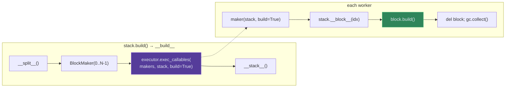

# Datastack

`Datastack` builds N child `Datablock`s (blocks) in parallel.

## Implementing a Block

A block is a plain `Datablock`.  Implement `CONFIG`, `TOPICS`, and `__build__`:

```python
class MyBlock(Datablock):
    TOPICS = {'output': 'output.parquet'}

    @dataclass
    class CONFIG(Datablock.CONFIG):
        idx: int = 0
        size: int = 100
        source_path: str = None    # shared config forwarded from the stack

    def __build__(self):
        start = self.cfg.idx * self.cfg.size
        df = load_slice(self.cfg.source_path, start, start + self.cfg.size)
        df.to_parquet(self.path())
```

The block knows nothing about parallelism — it just builds one piece of work.

## Implementing a Stack

```python
class MyStack(Datastack):
    @dataclass
    class CONFIG(Datablock.CONFIG):
        source_path: str = None
        n_items: int = 1000
        shard_size: int = 100

    @property
    def n_blocks(self) -> int:                          # REQUIRED
        return math.ceil(self.cfg.n_items / self.cfg.shard_size)

    def __block__(self, idx: int) -> Datablock:         # REQUIRED
        """Return block `idx`.  This runs INSIDE the worker."""
        return MyBlock(
            url=self.url,
            spec=dict(
                idx=idx,
                size=self.cfg.shard_size,
                source_path=self.cfg.source_path,       # forward shared config
            ),
        )

    # Optional hooks:
    # def __split__(self):  ...   # pre-build (e.g. partition input data)
    # def __stack__(self):  ...   # post-build (e.g. concatenate block outputs)
```

**Required:** `n_blocks` (property) and `__block__(idx)` (method).
**Optional:** `__split__()` and `__stack__()`.

## CONFIG vs Runtime Parameters

A `Datablock`'s identity hash is derived from its `CONFIG`.  Parameters that
change how data is *built* but not *what* data is built must stay **outside**
CONFIG:

| Parameter          | Where                 | Affects hash? | Example                       |
|--------------------|-----------------------|---------------|-------------------------------|
| source, model spec | `CONFIG` dataclass    | **Yes**       | `tilebag`, `evaluator_factory`|
| `device`           | `__init__` kwarg      | No            | `"cuda:0"`, `"cpu"`           |
| `device_batch_size`| `__init__` kwarg      | No            | `64`, `1024`                  |
| `n_workers`        | `__init__` kwarg      | No            | `4`                           |
| `parallelization`  | `__init__` kwarg      | No            | `"multiprocessing"`           |

`Datablock.__init__` absorbs extra kwargs into `self` automatically:

```python
class MyBag(Datablock):
    def __init__(self, *args, device_batch_size: int = 64, device: str = "cuda", **kwargs):
        Datablock.__init__(self, *args, device_batch_size=device_batch_size, device=device, **kwargs)
```

This stores `self.device_batch_size` and `self.device` without touching the hash.

## How Shared State Reaches Blocks

`stack.build(*args, **kwargs)` passes `*args, **kwargs` to
`Datastack.__build__(*args, **kwargs)`, but `__build__` does **not** forward
them to individual block builds.  This is deliberate: blocks build inside
workers (threads/processes/actors) where those args may not be serializable.

Shared state reaches blocks through three mechanisms:

1. **Through `spec`** (all backends) — Pass shared config fields from the
   stack's spec into each block's spec during `__block__()`.  This is the
   primary mechanism and always works because spec values are simple data.

   ```python
   def __block__(self, idx):
       return MyBlock(url=self.url, spec=dict(
           idx=idx,
           source_path=self.cfg.source_path,  # forwarded from stack config
       ))
   ```

2. **Through `__split__()` + ad hoc attributes** (multithreading only) —
   Compute expensive shared state once and store it on `self`.  Since
   `__block__` receives `self`, it can read these attributes:

   ```python
   def __split__(self):
       self._index = build_expensive_index(self.cfg.source_path)

   def __block__(self, idx):
       chunk = self._index[idx]
       return MyBlock(url=self.url, spec=dict(idx=idx, keys=chunk))
   ```

   > [!WARNING]
   > This only works with **multithreading** (shared memory).  For
   > multiprocessing/Ray, the stack is pickled via `__getstate__`, which only
   > serializes explicit `__init__` params and `self.parameters`.  Ad hoc
   > attributes like `self._index` are **silently dropped**.

3. **Through `__split__()` + filesystem** (all backends) — Write shared
   state to disk in `__split__()`, then have each block read it back:

   ```python
   def __split__(self):
       index = build_expensive_index(self.cfg.source_path)
       write_frame(index, os.path.join(self._url_, '_split_index.parquet'))

   def __block__(self, idx):
       return MyBlock(url=self.url, spec=dict(
           idx=idx,
           index_path=os.path.join(self._url_, '_split_index.parquet'),
       ))
   ```

## The `__split__()` and `__stack__()` Hooks

### `__split__()` — Precomputing Block Boundaries

`__split__()` runs **once** in the main process before any blocks are built.
Use it to evaluate expensive source data and precompute each block's input
boundaries.  For example, when building features from a collection of slides,
each block processes one slide's tile-bag.  Rather than letting every block
re-resolve the full collection, `__split__` resolves it once:

```python
def __split__(self):
    # Evaluate the source clip ONCE — resolves quoted specs, forms folds, etc.
    source_clip = self.cfg.source_clip
    # Precompute each block's boundaries and write a manifest to disk
    # so workers (including multiprocessing) can read it back.
    manifest = []
    for idx in range(self.n_blocks):
        bag = source_clip.block(idx)
        manifest.append({
            'idx': idx,
            'tag': bag.tag,
            'n_tiles': len(bag),
            'source_path': bag._url_,
        })
    write_frame(
        pd.DataFrame(manifest),
        os.path.join(self._url_, '_block_manifest.parquet'),
    )
```

The resulting manifest survives serialization (it's on disk) and gives each
block a lightweight handle to its input without re-evaluating the full
source collection.  `__block__` reads back just its row:

```python
def __block__(self, idx):
    manifest = read_frame(os.path.join(self._url_, '_block_manifest.parquet'))
    row = manifest.iloc[idx]
    return MyBag(url=self.url, spec=dict(
        idx=idx,
        source_path=row['source_path'],
    ), tag=row['tag'])
```

### Reusing Heavy Resources Across Blocks

Between `__split__()` and `__stack__()`, `Datastack.__build__` fans out block
construction to an **executor** — a pool of workers (threads, processes, or
Ray actors, controlled by the `parallelization=` kwarg).  Each worker receives
a chunk of `BlockMaker` callables and a copy of the `stack` object.  In
multiprocessing, `stack` is pickled once per worker and deserialized into a
single instance that is **reused for every BlockMaker call in that worker's
chunk** (see "Context Distribution" below).

This creates a natural place to cache expensive resources: if a block needs a
GPU model, you want to load it **once** and reuse it across all blocks in the
same worker.  The strategy differs by execution mode:

**Inline mode** — `__split__` creates the resource in the main process and
stores it on `self`.  Since there's no serialization, `BlockMaker.__call__`
reads it directly:

```python
def __split__(self):
    # ... precompute manifest as above ...
    if self.parallelization in (None, 'inline'):
        self._shared_evaluator = self.cfg.factory.evaluator(
            device=self._devices[0], log=self.log,
        )
```

**Multiprocessing mode** — `self._shared_evaluator` is dropped by pickling,
so `BlockMaker.__call__` lazily creates the evaluator **once per worker** and
caches it on the `stack` context object (which is shared across all
BlockMaker calls within a worker — see "Approach 2" below):

```python
class BlockMaker(Datastack.BlockMaker):
    def __init__(self, idx, *, device="cuda"):
        super().__init__(idx)
        self.device = device

    def __call__(self, stack, *, build=True):
        block = stack.__block__(self.idx, device=self.device)
        if build:
            # Reuse evaluator: inline gets it from __split__,
            # multiprocessing gets it from worker-local cache.
            if hasattr(stack, '_shared_evaluator'):
                evaluator = stack._shared_evaluator
            else:
                if not hasattr(stack, '_worker_evaluator'):
                    stack._worker_evaluator = stack.cfg.factory.evaluator(
                        device=self.device, log=stack.log,
                    )
                evaluator = stack._worker_evaluator
            block.build(evaluator=evaluator)
        del block; gc.collect()
```

The block's `__build__` accepts the evaluator as an optional kwarg, with a
fallback for standalone builds:

```python
class MyBag(Datablock):
    def __build__(self, evaluator=None):
        if evaluator is None:
            evaluator = self.cfg.factory.evaluator(device=self.device)
        features = evaluator(self.load_tiles())
        self.write_features(features)
```

| Execution mode  | Where evaluator is created    | How many loads             |
|-----------------|-------------------------------|---------------------------|
| Inline          | `__split__()` in main process | 1 total                   |
| Multiprocessing | `BlockMaker.__call__` lazily  | 1 per worker (not per block) |

### `__stack__()` — Building a Unified Index

`__stack__()` runs **once** in the main process after all blocks finish.
Use it to aggregate block outputs into a unified index that supports random
access over the full collection without materializing every block:

```python
def __stack__(self):
    # Collect per-block metadata into a unified index.
    index = []
    for i in range(self.n_blocks):
        bag = self.block(i)
        index.append({
            'block_idx': i,
            'tag': bag.tag,
            'n_samples': len(bag),
            'path': bag._url_,
        })
    index_df = pd.DataFrame(index)
    # Write as JSON for easy inspection, or parquet for performance.
    index_df.to_json(self.path('index', ensure_dirpath=True), orient='records', indent=2)
    # Persist bag_lens for O(1) len(clip) without materializing bags.
    bag_lens = index_df['n_samples'].values
    dbx.write_npz(self.path('bag_lens', ensure_dirpath=True), bag_lens=bag_lens)
```

The canonical `Clip.__stack__` in `databits.py` persists `bag_lens.npz` so
that `len(clip)` works without loading every bag:

```python
# databits.py — Clip.__stack__
def __stack__(self):
    bag_lens = [len(self.block(i)) for i in range(self.n_blocks)]
    dbx.write_npz(self.path('bag_lens', ensure_dirpath=True), bag_lens=bag_lens)
```

**When to extend `__stack__`:** If your downstream code needs to enumerate
blocks, look up tags, or compute dataset-level statistics (total samples,
feature dimensions, label distributions), do it in `__stack__` and persist the
result.  This avoids repeating the aggregation on every read.

## Usage

```python
stack = MyStack(
    url=dbx.env('DATA_ROOT'),
    spec=dict(source_path='/input/data', n_items=1000, shard_size=100),
    parallelization='multithreading',  # or 'multiprocessing', 'ray', None
    n_workers=4,
)
stack.build()
```

## How It Works



`BlockMaker` is a lightweight callable holding just an index.  It defers both
block construction (`__block__`) and building into the worker — the main process
never instantiates N full Datablocks.

## Context Distribution

`exec_callables(makers, stack, build=True)` splits `makers` across workers via
`np.array_split`.  The context args `(stack,)` and kwargs `{build: True}` are
**broadcast** to every callable:

```
Worker 0: makers[0](stack, build=True), makers[1](stack, build=True), ...
Worker 1: makers[3](stack, build=True), makers[4](stack, build=True), ...
```

For threads, `stack` is shared memory.  For processes, it is pickled once per worker.

## Executor Options

| `parallelization=`  | Backend                  | Notes                              |
|----------------------|--------------------------|------------------------------------|
| `None` / `'inline'` | Sequential loop          | Good for debugging                 |
| `'multithreading'`  | `threading.Thread`       | GIL-bound but low overhead         |
| `'multiprocessing'` | `mp.Process` (spawn)     | True parallelism; objects pickled   |
| `'ray'`             | Ray actors               | Distributed / cluster              |

## Multi-GPU

Most Datastacks don't need multi-GPU — `parallelization='multiprocessing'`
with CPU workers is often sufficient.  When you do need GPU parallelism,
two approaches exist:

| Approach | Use when | Tradeoff |
|----------|----------|----------|
| TorchDatablocksBuilder | Simple per-block GPU work, no `__split__`/`__stack__` needed | Bypasses Datastack lifecycle |
| BlockMaker device pinning | Full Datastack lifecycle + multi-GPU + resource caching | Overrides `__build__` entirely |

### Approach 1: TorchDatablocksBuilder (executor-level)

The executor handles `.to(device)` automatically.  Each block must implement
a `.to(device)` method:

```python
class MyGpuBlock(Datablock):
    TOPICS = {'features': 'features.pt'}

    def to(self, device):
        self._device = device
        return self

    def __build__(self):
        model = load_model().to(self._device)
        features = model(load_data(self.cfg.idx).to(self._device))
        torch.save(features.cpu(), self.path())

shards = [MyGpuBlock(url=..., spec=dict(idx=i)) for i in range(n)]
builder = TorchMultithreadingDatablocksBuilder(devices=['cuda:0', 'cuda:1'])
builder.build_blocks(shards)
```

The executor lifecycle: `.to(device)` → build → `.to('cpu')`.  One thread per
device.  This is the simplest approach but bypasses Datastack's `__split__`/`__stack__`
hooks.

### Approach 2: BlockMaker device pinning (stack-level)

Override `BlockMaker` to carry a device assignment and lazily cache expensive
resources per worker.  The executor splits makers into **contiguous chunks**
via `np.array_split` — one chunk per worker.  Assign the device per worker
chunk, not per block index, to avoid GPU thrashing.

> [!NOTE]
> **Why worker-local caching works:** Within a worker, `_run_items` passes
> the **same** `ctx_args` (containing `stack`) to every callable in the
> chunk.  So any attribute set on `stack` by the first BlockMaker persists
> for all subsequent ones — enabling lazy init with `hasattr` guards.

```python
class MyClip(Datastack):
    class BlockMaker(Datastack.BlockMaker):
        def __init__(self, idx, *, device="cuda"):
            super().__init__(idx)
            self.device = device          # survives pickling

        def __call__(self, stack, *, build=True):
            # Resolve source: precomputed (inline) or worker-local cache (mp).
            if hasattr(stack, '_precomputed_sources'):
                source = stack._precomputed_sources[self.idx]
            else:
                if not hasattr(stack, '_worker_source_clip'):
                    stack._worker_source_clip = stack.cfg.source_clip  # eval ONCE
                source = stack._worker_source_clip.block(self.idx)     # lazy

            block = stack.__block__(self.idx, device=self.device)
            block.keyby = stack.keyby
            if build:
                kwargs = {'source': source}
                # Evaluator: shared (inline) or worker-local cache (mp).
                if hasattr(stack, '_shared_evaluator'):
                    kwargs['evaluator'] = stack._shared_evaluator
                else:
                    if not hasattr(stack, '_worker_evaluator'):
                        stack._worker_evaluator = stack.cfg.factory.evaluator(
                            device=self.device, log=stack.log,
                        )
                    kwargs['evaluator'] = stack._worker_evaluator
                block.build(**kwargs)
            del block; gc.collect()

    def __build__(self, *args, **kwargs):
        self.__split__()
        devices = self._devices               # e.g. ["cuda:0", "cuda:1"]
        n_workers = len(devices)

        # In inline mode, precompute everything in the main process.
        inline = (self.parallelization in (None, 'inline') and len(devices) == 1)
        if inline:
            self._shared_evaluator = self.cfg.factory.evaluator(device=devices[0])
            self._precomputed_sources = [
                self.cfg.source_clip.block(i) for i in range(self.n_blocks)
            ]

        # Mirror the executor's chunking to assign device per worker.
        chunks = np.array_split(range(self.n_blocks), n_workers)
        block_device = {}
        for w, chunk in enumerate(chunks):
            for idx in chunk:
                block_device[idx] = devices[w]

        makers = [self.BlockMaker(idx, device=block_device[idx])
                  for idx in range(self.n_blocks)]
        executor = self.executor_cls(
            n_workers=n_workers,
            tag=f"BUILDING {len(makers)} blocks [{self.__class__.__name__}]",
        )
        try:
            executor.exec_callables(makers, self, build=True)
        finally:
            for attr in ('_shared_evaluator', '_precomputed_sources'):
                if hasattr(self, attr):
                    delattr(self, attr)
        self.__stack__()
        return self
```

> [!WARNING]
> This overrides `Datastack.__build__` entirely, bypassing its built-in
> logging, `multiprocessing_start_method` handling, and executor kwargs
> construction.  Only do this when you need device-level control that the
> base implementation doesn't provide.

This eliminates two common performance traps:
- **O(N²) source formation** — without caching, each block re-evaluates its
  quoted spec, re-forming the entire source collection.  With worker-local
  caching, the source clip is evaluated once per worker, then `.block(idx)`
  lazily resolves individual items.
- **Per-block model reload** — without caching, each block instantiates its own
  evaluator (loading model weights from disk).  With worker-local caching, one
  evaluator is created per worker and reused for the entire chunk.

The block's `__build__` accepts optional injected resources with fallbacks:

```python
class MyBag(Datablock):
    def __build__(self, evaluator=None, source=None):
        if evaluator is None:
            evaluator = self.cfg.factory.evaluator(device=self.device)
        if source is None:
            source = self.cfg.source      # fallback: evaluate quoted spec
        # ... use evaluator and source ...
```

| Mode             | Evaluator lifecycle                        | Source resolution      |
|------------------|--------------------------------------------|------------------------|
| Inline (1 GPU)   | Load once, share via `_shared_evaluator`   | Precomputed list       |
| Multiprocessing  | Load once per worker via `_worker_evaluator`| Worker-local clip cache|

## Gotchas

| Issue | Cause | Fix |
|-------|-------|-----|
| `AttributeError` on `self._foo` in worker | Ad-hoc attrs dropped by `__getstate__` | Store on `BlockMaker`, use `spec`, or write to disk |
| Hash changes when `device` added to CONFIG | Runtime params in CONFIG affect identity | Keep them as `__init__` kwargs only |
| Per-block model reload in multiprocessing | No evaluator caching across blocks in a worker | Worker-local caching via `hasattr` on `stack` |
| O(N²) source formation | Each block re-evaluates quoted spec for source clip | Cache source clip on `stack`, use `.block(idx)` |
| OOM with multi-GPU | Round-robin `idx % n_devices` → workers switch GPUs | Use worker-chunk alignment |
| CUDA context errors in multiprocessing | Shared evaluator across process boundaries | Each worker loads its own evaluator |
| `spawn` vs `fork` deadlocks | `fork` + CUDA = deadlocks | Default is `spawn`; use `multiprocessing_start_method` |

## Wire Protocol

Workers report results via a shared queue:

```
Success: (True,  worker_idx, [(item_idx, payload), ...])
Failure: (False, worker_idx, item_idx, (exception, traceback_str))
```

On failure, main sets `abort_event`, joins workers, re-raises.
Results are placed by `item_idx` so output order matches input order.
